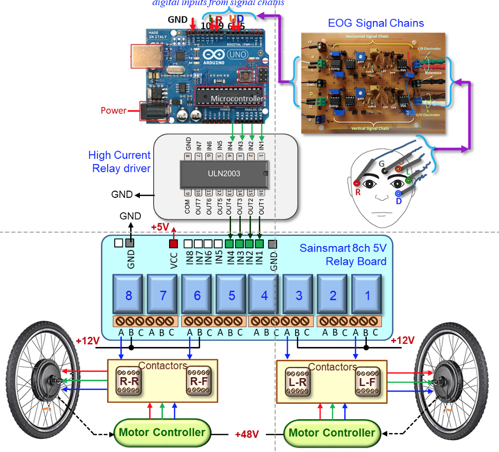
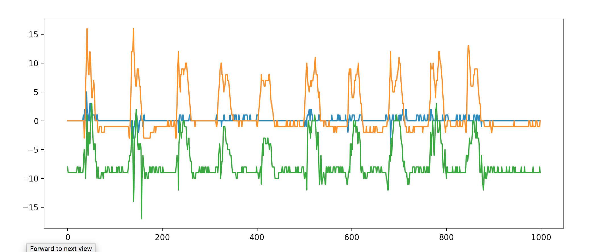
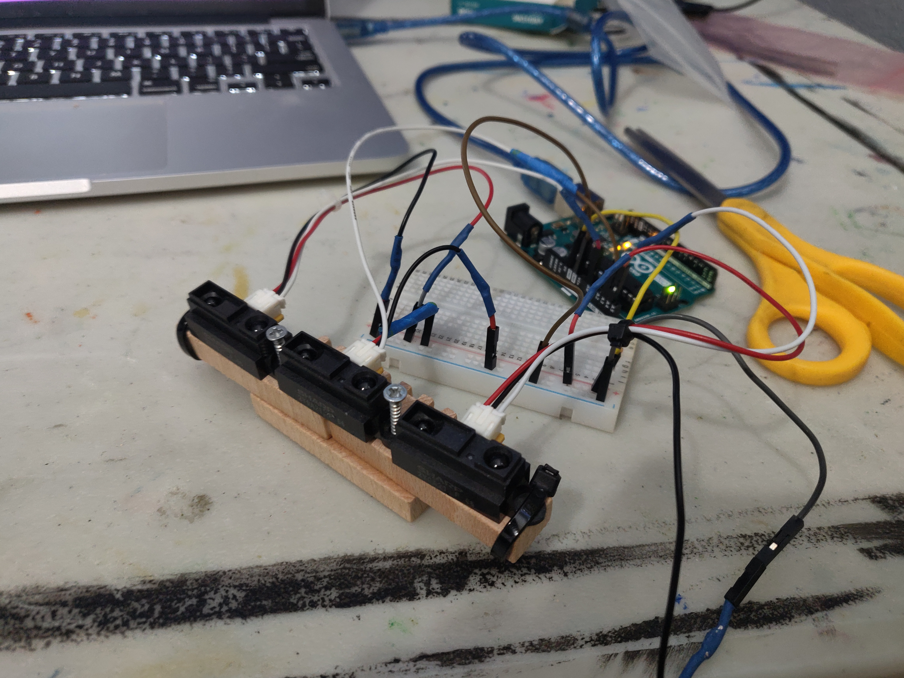
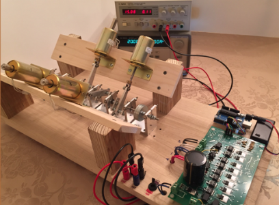
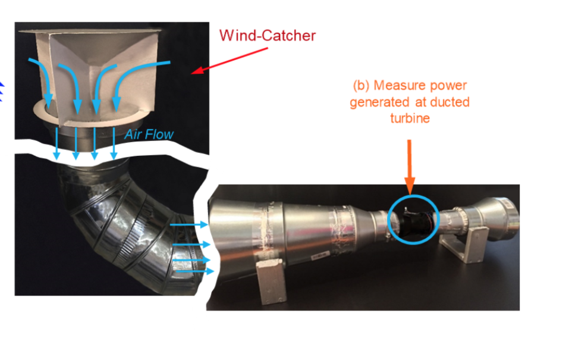
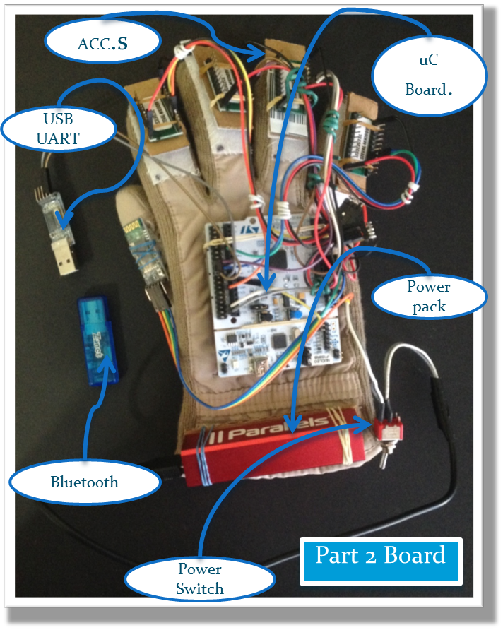

# Portfolio
---
 
## [EyeMove](https://drive.google.com/file/d/1IlpRCeHtpIOetM61K2dKlG159A8ItXoe/view?usp=sharing)
Eye controlled wheelchair using electrooculography to provide mobility and quality of life for patients with paralysis. 
*$20,000 scholarship, First Place and Best in Category at International Science Fair* 
[VIDEO](https://drive.google.com/file/d/1fZwC75670PF3u-IC0tM1i57zqECTpdxU/view?usp=sharing) | [DATA](images/eyemove/images.pdf) | [POSTER](https://drive.google.com/file/d/1IlpRCeHtpIOetM61K2dKlG159A8ItXoe/view?usp=sharing) | [DETAILED REPORT](https://drive.google.com/file/d/1vHkEWxq-VxoYV0PFYkr5b7bq4x1ndeOr/view?usp=sharing)   

---
 
## [MacMusic Control](https://github.com/mshah0686/MacMusicControl)
Machine learning for gesture recognition using Hexiwear, a wearable IOT device, to control Spotify music.   

---
 
## [ImageProcessor](https://github.com/mshah0686/ImageProcessor)
Digital image processing visualizer with multiple analysis tools using Numpy and Tkinter.   

---
 
## [AirControl](https://github.com/mshah0686/AirControl)
Device to detect air gestures using IR sensors as external input to laptop to increase productivity using Scikit learn.   

---
 
## [Pokedex](https://github.com/mshah0686/pokedex)
Pokemon image recognition using Tensorflow and webscraping with Beautiful Soup.   

---
 
## [True-HEV](http://example.com/)
Creating a true hybrid engine with electric solenoids integrated into an existing Internal Combustion Engine for lower pollution output.  
*3rd place at International Science Fair* 
[VIDEO](https://drive.google.com/file/d/0B3_nstnD89jVY0xnZkItYWNLY0E/view?usp=sharing) | [POSTER](images/truehev/poster.pdf) | [REPORT](images/truehev/report.pdf)   

---
 
## [Breezing-By](http://example.com/)
Improving wind turbines to capture energy at low wind speeds using Venturi effect.  
*Silver Medal International Science Symposium* 
[REPORT](images/breezingby/report.pdf)

---
 
## [Keyboardless Keyboard](http://example.com/)
Using accelerometers to create virtual typing experience with BLE communication.  
*International Science Fair Qualifier* 
[REPORT](images/keyboardlesskeyboard/report.pdf)   
